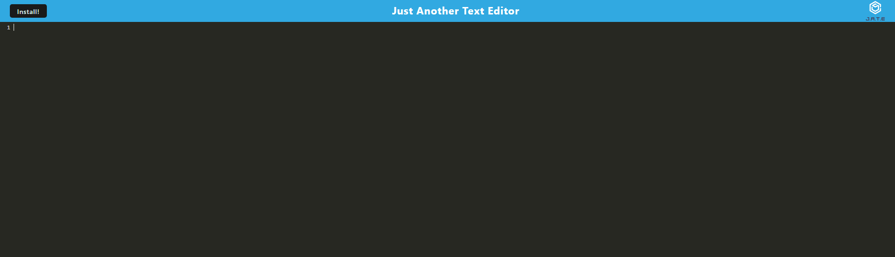

# Text Editor Starter Code

## Description

A PWA text editor that runs on a browser and can also run offline.

## Installation

install using 'npm i', seed the database using 'npm run seed' and start the application using npm run start'

## Usage

[https://progressive-web-application19.herokuapp.com/](https://progressive-web-application19.herokuapp.com/)

